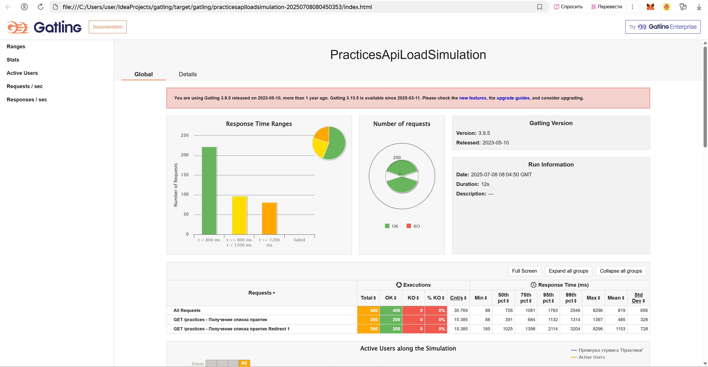

# 🎰 Нагрузочное тестирование
> [!Note]
> Нагрузочное тестирование с помощью фреймворка Gatling

## Архитектура проекта
* **steps** - http действия.
* **scenarios** - бизнес-логика теста.
* **tests** - конфигурация нагрузки.

> [!TIP]
> Для визуализации отчетов прогонов НТ необходимо [скопировать по ссылке](https://github.com/gatling/gatling/blob/main/gatling-core/src/main/resources/logback.dummy) и добавить в папку resources с расширением .xml 

## Результат
> [!IMPORTANT]
> Отчет сохраняется в папке target/gatling
> 

